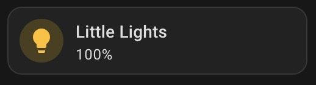
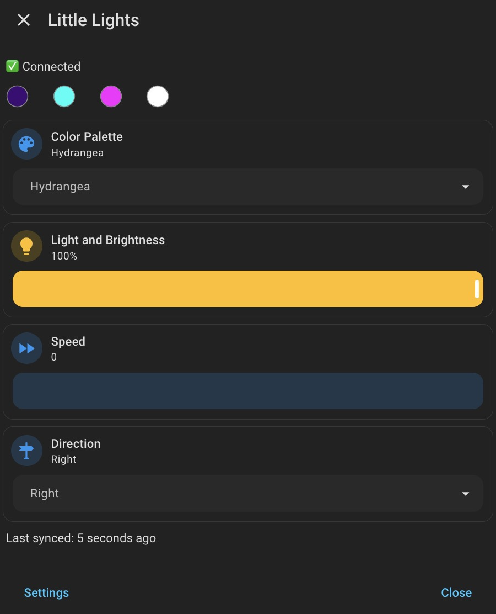

# BLE Lights

Bluetooth Low Energy Lights Controller Integration for Home Assistant

Forked from https://github.com/fuatakgun/generic_bt

Connects to Adafruit Bluefruit LE SPI Friend lights controllers

## Installation via HACS

### One click install

Click the badge to add:

[](https://my.home-assistant.io/redirect/hacs_repository/?owner=twzkraus&repository=ble_lights&category=integration)

Then restart Home Assistant

### Manual Installation

1. In Home Assistant, open HACS
2. Top-right ⋮ → Custom repositories
3. Add repository URL `https://github.com/twzkraus/ble_lights` with category: Integration
4. Find **BLE Lights** in HACS and click **Download**.
5. Restart Home Assistant

## Entities

### `light`

The overall light for your controller. Supported features:

- Brightness
- Effect
  - Still
  - Blink
  - Twinkle
  - Chase
  - Moving Wave
  - Ants
  - Sparkle
  - White Sparkle
  - Three Block
  - Trains
  - Cross Fade
  - Blocks
  - Block Gradient
  - Spiral
  - Shimmer
  - Glow Worm
  - Clouds
  - Color Pulse
  - Random Placement
  - Electric Shock

#### Attributes

The `light` also includes the core attributes of the controller, useful for debugging. Example:

```
- effect_list: Still, Blink, Twinkle, Chase, Moving Wave, Ants, Sparkle, White Sparkle, Three Block, Trains, Cross Fade, Blocks, Block Gradient, Spiral, Shimmer, Glow Worm, Clouds, Color Pulse, Random Placement, Electric Shock
- supported_color_modes: brightness
- effect: Blink
- color_mode: brightness
- brightness: 255
- program_code: B
- program_name: Blink
- speed: 1
- colors:
  - hue: 191
    saturation: 255
    value: 118
  - hue: 126
    saturation: 255
    value: 255
  - hue: 212
    saturation: 255
    value: 255
  - hue: 0
    saturation: 0
    value: 255
  - hue: 0
    saturation: 0
    value: 0
  - hue: 0
    saturation: 0
    value: 0

- direction_code: 2
- direction_name: Right
- raw_hex: 4201bfff767effffd4ffff0000ff000000000000010101120000160001000700000a00ff140002ff
- last_updated: 2026-07-08 09:00:31
- friendly_name: Finn's Fabulous Lights
- supported_features: 4
```

### `select`

Color palette selector. Color palettes:

- 4th of July
- Candy
- Cherry Blossom
- Christmas
- Confetti
- Diamonds
- Easter
- Fall Green
- Fall Red
- Five Color
- Go Pack Go
- Halloween
- Hydrangea
- Lindsay
- Mardi Gras
- Moonlight
- Rainbow
- Sapphire
- St. Patrick's Day
- Starry Night
- Under the Sea
- Valentine's Day

### `switch`

BLE connectivity toggle. Upon toggling on, the light state will be synced to HA.

### `number`

BLE connectivity timeout since the last successful communication with the device. Defaults to 30 seconds.

## Services

### `ble_lights.turn_on`

Primary entry point for taking action. Designed to mimic the default `light.turn_on` service in HA, but extended for our unique attributes such as Color Palette, Colors[], Speed, and Direction.

#### Target entity

the `light` entity you want to control

#### Fields

- `Color Palette` selector
  - see Color Palette options above
  - if provided, `Colors` input will be ignored
- `Effect` selector
  - see Effect options above
- `Brightness` number input
  - 0-255

##### Advanced settings

- `Speed` number input
  - 0-255
- `Direction` selector
  - `Left | Right | Center`
- `Color {n}` RGB color picker
  - RGB color for up to 6 color slots
  - the first unset value stops the sequence, so always fill starting at 1

### `ble_lights.sync_state`

Updates the current state and attributes of the controller. Should not be necessary in normal use, as simply connecting to the device will do the same.

#### Target entity

the `light` entity you want to control

## Polling

State polling is done 30 seconds after each hour and 10 seconds after a scheduled timer action

## Dashboard card example

The below example uses [browser_mod](https://github.com/thomasloven/hass-browser_mod) and [mushroom cards](https://github.com/piitaya/lovelace-mushroom)

It includes a tile card on the dashboard that, on click:

- Connects to the device
- Opens the Browser mod modal to show more device settings

### Video

<video width="180" height="360" controls>
  <source src="./images/dashboard-card-and-popup.MP4" />
</video>

### Screenshots

#### Main dashboard card



```yaml
type: tile
grid_options:
  columns: 6
  rows: 1
entity: light.<your_light>
name: <your_light_name>
vertical: false
tap_action:
  action: fire-dom-event
  browser_mod:
    service: browser_mod.sequence
    data:
      sequence:
        - service: browser_mod.more_info
          data:
            entity: light.<your_light>
        - service: switch.turn_on
          target:
            entity_id: switch.<your_light>_connection
features_position: bottom
```

And color visualizer below it:

```yaml
type: markdown
text_only: true
content: >-
  {%- set x = c * (1 - (hh % 2 - 1) | abs) -%}#{{ '%02x' % (((ns.r + m) *
  255) | round | int) }}{{ '%02x' % (((ns.g + m) * 255) | round | int) }}{{
  '%02x' % (((ns.b + m) * 255) | round | int) }}  ~ '"
  stroke="#888888" stroke-width="1"/></svg>') | urlencode }})&nbsp;
grid_options:
  columns: 6
  rows: auto
```

#### Browser mod popup-card



```yaml
type: custom:popup-card
card:
  type: vertical-stack
  cards:
    - type: markdown
      content: >-
        

        {{
          '✅ Connected' if state == "on"
          else 'Connecting...' if state == "off"
          else state | capitalize
        }}
      text_only: true
    - type: markdown
      visibility:
        - condition: state
          entity: switch.<your_light>_connection
          state: "on"
      text_only: true
      content: >-
        {%- set x = c * (1 - (hh % 2 - 1) |
        abs) -%}#{{ '%02x' % (((ns.r + m) * 255) | round | int)
        }}{{ '%02x' % (((ns.g + m) * 255) | round | int) }}{{ '%02x' % (((ns.b +
        m) * 255) | round | int) }}  ~ '" stroke="#888888" stroke-width="1"/></svg>') | urlencode
        }})&nbsp;&nbsp;&nbsp;&nbsp;&nbsp;&nbsp;&nbsp;&nbsp;
    - type: custom:mushroom-select-card
      visibility:
        - condition: state
          entity: switch.<your_light>_connection
          state: "on"
      entity: select.<your_light>_color_palette
      name: Color Palette
    - type: tile
      grid_options:
        columns: 12
        rows: 2
      visibility:
        - condition: state
          entity: switch.<your_light>_connection
          state: "on"
      entity: light.<your_light>
      name: Light and Brightness
      vertical: false
      tap_action:
        action: more-info
      features:
        - type: light-brightness
      features_position: bottom
    - type: custom:mushroom-number-card
      visibility:
        - condition: state
          entity: switch.<your_light>_connection
          state: "on"
      entity: number.<your_light>_effect_speed
      name: Speed
    - type: custom:mushroom-select-card
      visibility:
        - condition: state
          entity: switch.<your_light>_connection
          state: "on"
      entity: select.<your_light>_effect_direction
      name: Direction
    - type: markdown
      content: >-
        {{ 'Last synced: ' ~
        time_since(as_datetime(state_attr("light.<your_light>",
        "last_updated"))) ~ ' ago'}}
      text_only: true
title: <your_light_name>
popup_card_id: <your_light>-popup-card
popup_card_all_views: false
right_button_close: true
left_button_close: true
right_button: Close
right_button_appearance: plain
initial_style: classic
dismiss_icon: ""
style_sequence: []
left_button_action:
  - action: browser_mod.navigate
    metadata: {}
    data:
      path: /config/devices/device/<your_device_id>
target:
  entity_id:
    - light.<your_light>
left_button: Settings
```

## Disclaimer

Not affiliated with Adafruit or any other company that makes BLE lights. This is just a personal side project. Use this integration at your own risk.
